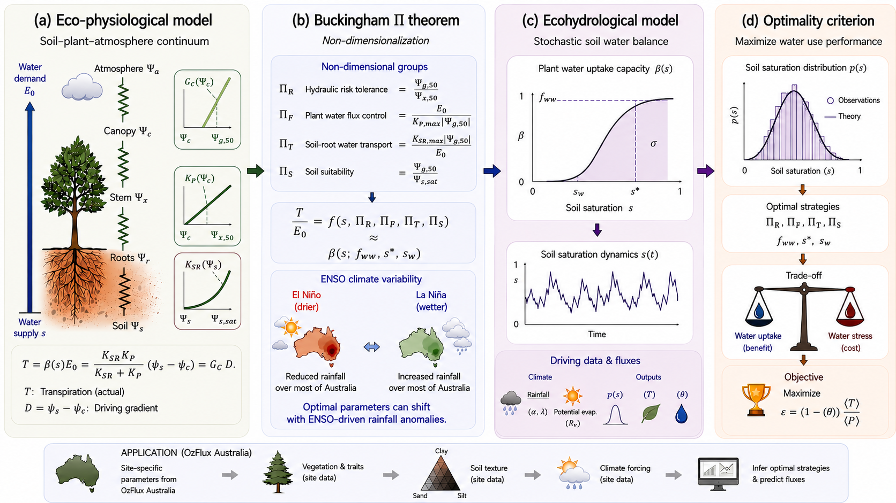

# Stochastic Soil Water Model (SSWM) and Eco-Evolutionary Optimality (EEO) Calibration across Australian Ecosystems

This repository contains the complete codebase, Slurm configurations, processed calibration datasets, and manuscript generation pipelines for reproducing the study on vegetation water-use strategies.



## License

This project is licensed under the **MIT License** - see the [LICENSE](LICENSE) file for details.

**Copyright (c) 2026 Sanjay N C, IITB-Monash Research Academy**

---

## Affiliation & Contact Information

* **Author**: Sanjay N C
* **Title**: Ph.D. Student, IITB-Monash Research Academy
* **Emails**:
  * [sanjaync@iitb.ac.in](mailto:sanjaync@iitb.ac.in)
  * [sanjaync@monash.edu](mailto:sanjaync@monash.edu)
  * [sanjaync2011@gmail.com](mailto:sanjaync2011@gmail.com)
* **Phone**: +91 9972461435

---

## Supplementary Material

**Paper Supplementary Files**: The supplementary material for this paper is located in a separate repository:
- **Repository**: [https://github.com/sanjaync/paper_1_supply_files.git](https://github.com/sanjaync/paper_1_supply_files.git)
- This repository contains additional supporting figures, tables, datasets, and documentation referenced in the manuscript.

---

## 1. Project Overview

This study explores the physiological mechanisms regulating vegetation water-use efficiency under varying soil moisture constraints using the parsimonious **Stochastic Soil Water Model (SSWM)** framework.

### Model Structure

The analysis comprises two complementary calibration strategies across 17 Australian OzFlux sites:

1. **Baseline Run**: Standard single-equation Priestley-Taylor (PT) Potential Evapotranspiration (PET) forcing, comparing:
   * *Empirical Best Fit (BF)*: MCMC calibration against observed soil moisture probability density functions (PDFs).
   * *Eco-Evolutionary Optimality (OPT)*: Theoretical calibration maximizing carbon-use efficiency ($\epsilon$).
2. **Ensemble Run**: Multi-model consensus forcing (Top-5 Mean PET, ranked using Kling-Gupta Efficiency against the ASCE Penman-Monteith standard), exploring the "rescue-versus-overdrive" trade-off.

### 1.1 Ensemble PET Formulation and Model Selection

To assess the impact of structural forcing uncertainty, 18 potential evapotranspiration (PET) models spanning temperature-based, radiation-based, and combination physical equations were computed across all sites.

The selection of the consensus ensemble forcing proceeded as follows:

* **Reference Baseline**: The ASCE Penman-Monteith (ASCE-PM) equation, requiring solar radiation, wind speed, relative humidity, and air temperature, was treated as the physical standard.
* **Evaluation Metrics**: Each of the 18 candidate PET methods (e.g. Hargreaves, Turc, Makkink, Abtew, Priestley-Taylor, Blaney-Criddle, etc.) was compared against ASCE-PM at daily steps for each site.
* **Performance Ranking**: The Kling-Gupta Efficiency (KGE) score was computed for each candidate method to capture correlation, bias, and variability simultaneously.
* **Top-5 Consensus Selection**: At each site, the 5 models achieving the highest KGE scores were identified. The daily arithmetic average of these Top-5 methods defines the **Ensemble Consensus PET**.

---

## 2. Directory Structure

```directory
OWUS_Australia_GitHub_Publish/
├── README.md                  # This documentation file
├── LICENSE                    # MIT License file
├── OWUS_Workflow_Explained.md # Step-by-step mathematical & coding workflow guide
├── paper1_abstract_chatgpt.png    # Graphical abstract summary image
├── code/                      # Python core modeling, analysis, and generation scripts
│   ├── sswm.py                # Stochastic Soil Water Model physics engine
│   ├── param_sm_pdf.py        # Soil moisture PDF parameter estimation routines
│   ├── data_management.py     # Data parsing, QC filtering, and IO utilities
│   ├── create_figs.py         # MCMC diagnostics, priors, and PDF plotting library
│   ├── validate_with_observations.py       # Tripartite physiological validation scripts
│   ├── validate_apd_tripartite_selected_sites.py # Trait comparisons against observations
│   ├── run_paper_figs_selected_sites.py     # Global analysis plotting wrapper
│   ├── generate_latex_report.py             # Compilation script for the baseline manuscript
│   ├── generate_latex_report_ensemble.py    # Compilation script for the ensemble manuscript
│   ├── generate_growing_season_report.py   # Compilation script for the growing seasons report
│   ├── generate_smart_ensemble_report.py    # Compilation script for the 41-site smart PET ensemble report
│   ├── sanjay_data_creation/  # Preprocessing pipeline (coordinates, soil textures, MODIS LAI)
│   ├── ENSO_experiment_updated/ # Code, results, and summary report for El Niño/La Niña shifts
│   ├── sapflux/               # Sapflux analysis code
│   │   ├── Sapflux_australia_updated.py     # Sapflux preprocessing and cleaning
│   │   ├── run_calibration.py               # Calibrates plant traits against sap velocity
│   │   ├── run_final_plots.py               # Generates validation diurnal/seasonal plots
│   │   ├── run_analysis_v2.py               # Statistical evaluation of model metrics
│   │   └── create_site_map.py               # Map creation script for Robson/Cow Bay sites
│   ├── footprint/             # Footprint representativeness analysis code
│   │   ├── run_all_footprints.py            # Computes footprint climatology models
│   │   ├── generate_site_appendices.py      # Programmatic site appendix compiler
│   │   ├── footprint_GUI.py                 # Interface dashboard utility
│   │   ├── export_mat_footprints.py         # Prepares MATLAB input/output arrays
│   │   └── convert_kmz_for_ge_online.py     # Google Earth online visualizer
│   ├── soil_depth/            # Soil moisture profile sensor placement code
│   │   ├── generate_diagrams.py             # Draws flux tower probe diagrams
│   │   ├── generate_report.py               # Report compiler for tower sensor depth
│   │   └── generate_report_v2.py            # Detailed soil depth LaTeX report compiler
│   └── slurm/                 # HPC Slurm batch submission scripts
│       ├── run_mcmc.slurm                   # Runs full parameter calibration queue
│       ├── run_paper_figs_selected_sites.slurm # Generates the 3-panel site diagnostic grids
│       └── run_val_apd_selected_sites.slurm  # Submits the tripartite validation pipeline
├── data_info/                 # Processed parameter fits and performance metrics (fast-start)
│   ├── data_registry.csv      # CSV catalog linking datasets to absolute HPC paths
│   ├── input_data.zip         # Zipped meteorological & parameter pickle files for 17 sites
│   ├── baseline_nse_comparison.csv          # PT baseline BF vs OPT performance table
│   ├── baseline_results_bf.csv              # Calibrated parameters under PT (Empirical Fit)
│   ├── baseline_results_opt.csv             # Calibrated parameters under PT (Optimality Fit)
│   ├── ensemble_nse_comparison.csv          # PT vs. Ensemble PET performance comparison
│   ├── ensemble_results_bf.csv              # Calibrated parameters under Ensemble (Empirical Fit)
│   ├── ensemble_results_opt.csv             # Calibrated parameters under Ensemble (Optimality Fit)
│   └── validation_data/       # Local copies of field observations for offline validation
│       ├── Cow_Bay_Predawn_and_Midday_leaf_water_potential_data.csv
│       ├── Cow_Bay__pneumatic_vulnerability_curve_data.csv
│       ├── Robson_Creek_Predawn_and_Midday_leaf_water_potential_data.csv
│       └── Robson_Creek_pneumatic_vulnerability_curve_data.csv
└── reports/                   # Compiled manuscript PDFs and LaTeX sources
    ├── paper_report_baseline.pdf            # 57-page Baseline Manuscript & Appendix (PDF)
    ├── paper_report_baseline.tex            # Baseline Manuscript LaTeX Source
    ├── paper_report_ensemble.pdf            # 57-page Ensemble Manuscript & Appendix (PDF)
    ├── paper_report_ensemble.tex            # Ensemble Manuscript LaTeX Source
    ├── growing_season_report.pdf            # 33-page Comparative Growing Season Report (PDF)
    ├── growing_season_report.tex            # Growing Season Report LaTeX Source
    ├── Comparison_Report_SideBySide.pdf     # Side-by-Side Model Comparison Report (PDF)
    ├── Comparison_Report_SideBySide.tex     # Side-by-Side Comparison LaTeX Source
    ├── PET_SmartEnsemble_Report.pdf         # 45-page Smart PET Ensemble Validation Report (PDF)
    ├── PET_SmartEnsemble_Report.tex         # Smart PET Ensemble Report LaTeX Source
    ├── OzFlux_Tower_Report.pdf              # OzFlux Tower Soil Moisture Sensor Depth Report (PDF)
    ├── OzFlux_Tower_Report.tex              # OzFlux Tower Soil Moisture Report LaTeX Source
    ├── OzFlux_Tower_Report_Detailed.pdf     # Detailed OzFlux Tower Sensor Depth Report (PDF)
    └── OzFlux_Tower_Report_Detailed.tex     # Detailed OzFlux Tower Report LaTeX Source
├── paper/                     # Folder containing reference literature and background tutorial PDFs
└── zip_archives/              # Compressed project archives (LaTeX source, figures, intermediate logs)
    ├── FINAL_PAPER_BUNDLE.zip          # Full Baseline PT project folder
    ├── FINAL_PAPER_BUNDLE_ENSEMBLE.zip # Full Top-5 Ensemble consensus project folder
    ├── ENSO_experiment_updated.zip     # Full ENSO anomaly branch project folder
    ├── Sapflux_australia.zip           # Full Sapflux Australia dataset & analysis folder
    ├── PET_Results_SmartEnsemble.zip   # Full Smart PET Ensemble evaluations across 41 sites
    ├── OzFlux_Footprint_Analysis.zip   # Full footprint representativeness analysis folder
    ├── PyFluxPro_Plots.zip             # 357 annual site quality-control reports via PyFluxPro
    ├── L6_Site_Metadata_Reports.zip    # 90 L6 metadata site guides and reports
    ├── Yearly_Split_Plots.zip          # 351 annual split compliance reports
    └── FluxTower_Diagrams.zip          # Soil depth diagrams and profile sensor setups
```

---

## 3. HPC Environment & Setup

All calibrations were conducted on the Monash University High-Performance Computing (HPC) environment.

### Conda Environment Activation

A pre-configured Conda environment containing JAX, NumPy, SciPy, Pandas, Matplotlib, and `pyet` is used for modeling and analysis:

```bash
module load miniforge3
conda activate ismn
```

### Slurm Jobs Configuration

To run the full calibration suite in parallel across the 17 sites, submit the Slurm batch scripts:

```bash
sbatch code/slurm/run_mcmc.slurm
sbatch code/slurm/run_val_apd_selected_sites.slurm
```

---

## 4. High-Performance Computing Data Links & Availability

Because the raw forcing datasets, MCMC traces, and diagnostic plots are extremely large (tens of gigabytes), they are hosted directly on the Monash HPC storage clusters.

### Forcing & Calibration Data

* **Raw Input Forcing (OzFlux NetCDF / Soil Grids)**:
  * Located at: `/home/sanjays/et97_scratch2/oldscratch/Ozflux_data_full/`
  * Contains daily precipitation, solar radiation, relative humidity, air temperature, wind speed, and eddy-covariance latent/sensible heat fluxes for the 17 sites.
* **Baseline Calibration Outputs**:
  * Located at: `/home/sanjays/et97_scratch2/oldscratch/Ozflux_data_full/OWUS_australia_agent_3_scientific/FINAL_PAPER_BUNDLE/`
  * Contains MCMC diagnostic traces, posteriors, and fitted PDF plots under `output_corrected/`.
* **Ensemble Calibration Outputs**:
  * Located at: `/home/sanjays/et97_scratch2/oldscratch/Ozflux_data_full/OWUS_australia_ensemble_top5/FINAL_PAPER_BUNDLE_ENSEMBLE/`
  * Contains MCMC diagnostic traces and outputs for the Top-5 mean PET runs.
* **Smart PET Ensemble Evaluations (41 sites)**:
  * Located at: `/home/sanjays/et97_scratch2/oldscratch/Ozflux_data_full/PET_Results_SmartEnsemble/`
  * Contains daily timeseries evaluations, ranked formulation metrics (KGE, R2, RMSE, Bias) compared against standard PM ASCE reference, and individual site diagnostic subplots.

### Validation Data

Leaf water potential data, pneumatic vulnerability curves, and sap velocity observations used to validate modeled hydraulic thresholds ($P_{x50}$ and $P_{g50}$) and water-use strategies are stored as follows:

* **Leaf Water Potential & Vulnerability Data (HPC Directory)**: `/home/sanjays/et97_scratch2/oldscratch/Ozflux_data_full/OWUS_australia_ensemble_top5/FINAL_PAPER_BUNDLE_ENSEMBLE/02_Validation_Physical/`
  * `Cow_Bay_Predawn_and_Midday_leaf_water_potential_data.csv`: Measured $\Psi$ dynamics for rainforest species.
  * `Cow_Bay__pneumatic_vulnerability_curve_data.csv`: Measured hydraulic vulnerability parameters.
  * `Robson_Creek_Predawn_and_Midday_leaf_water_potential_data.csv`: Wet sclerophyll forest validation metrics.
  * `Robson_Creek_pneumatic_vulnerability_curve_data.csv`: Pneumatic vulnerability validation parameters.
* **Sapflux Australia Dataset (HPC Directory)**: `/home/sanjays/et97_scratch2/oldscratch/Ozflux_data_full/Sapflux_australia/`
  * Contains xlsx spreadsheets of continuous sap velocity measurements for Cow Bay and Robson Creek, corresponding soil water potentials, tree inventory details, TERN validation data, and processing notebooks.
* **OzFlux Footprint Climatology & Representativeness (HPC Directory)**: `/home/sanjays/et97_scratch2/oldscratch/Ozflux_data_full/PyFluxPro/OzFlux-footprint/`
  * Contains site-by-site daily/monthly footprint netCDF datasets, Google Earth KMZ conversion tools, representativeness assessment scripts, and Slurm arrays configurations.
* **Flux Tower Soil Depth Metadata & Placements (HPC Directory)**: `/home/sanjays/et97_scratch2/oldscratch/Ozflux_data_full/L6/soil_depth_plots/`
  * Contains probe depth data tables, automatic tower sensor depth profile diagram scripts, and compiled PDF validation reports.
* **PyFluxPro Quality-Control Diagnostic Reports (HPC Directory)**: `/home/sanjays/et97_scratch2/oldscratch/Ozflux_data_full/PyFluxPro/plots/`
  * Contains 357 annual site-level quality-control reports in PDF format generated via PyFluxPro.
* **L6 Site Metadata Reports (HPC Directory)**: `/home/sanjays/et97_scratch2/oldscratch/Ozflux_data_full/L6/site_metadata_reports/`
  * Contains 90 PDF and LaTeX metadata files explaining variables and instrumentation for the L6 quality control levels.
* **L6 Yearly Split Compliance Reports (HPC Directory)**: `/home/sanjays/et97_scratch2/oldscratch/Ozflux_data_full/L6/Yearly_Split_Data/automated_plots/plots_reports/`
  * Contains 351 annual validation and data compliance reports in PDF format for the L6 splits.

---

## 5. Reproduction Guide

Using the provided processed calibration outputs in `data_info/`, you can reproduce the manuscripts and reports instantly without re-running the expensive MCMC calibrations:

1. **Compile the Baseline Manuscript & Appendix (57 pages)**:

   ```bash
   python code/generate_latex_report.py
   ```

2. **Compile the Ensemble Manuscript & Appendix (57 pages)**:

   ```bash
   python code/generate_latex_report_ensemble.py
   ```

3. **Compile the Comparative Growing Season Report (33 pages)**:

   ```bash
   python code/generate_growing_season_report.py
   ```

4. **Compile the Side-by-Side Model Comparison Report**:

   To recompile the Side-by-Side Model Comparison PDF from its LaTeX source:
   ```bash
   pdflatex -output-directory=reports reports/Comparison_Report_SideBySide.tex
   ```

5. **Compile the Smart PET Ensemble Validation Report (45 pages)**:

   To programmatically extract formulation rankings and compile the 45-page validation report across the 41 OzFlux sites:
   ```bash
   python code/generate_smart_ensemble_report.py
   ```

6. **Compile the Soil Moisture Sensor Placement Reports**:

   To recompile the Flux Tower Soil Depth Reports from their LaTeX sources:
   ```bash
   pdflatex -output-directory=reports reports/OzFlux_Tower_Report.tex
   pdflatex -output-directory=reports reports/OzFlux_Tower_Report_Detailed.tex
   ```

*Note: Compiling these reports requires `pdflatex` to be installed on your system path to render the PDF documents.*

---

## 6. Complete Project Archives (Zip Files)

For offline access or full local execution, ten separate self-contained zip archives are provided under the `zip_archives/` folder. These files contain all intermediate build logs, full high-resolution figure datasets, and complete LaTeX project directories.

* **Baseline Paper Bundle ([zip_archives/FINAL_PAPER_BUNDLE.zip](zip_archives/FINAL_PAPER_BUNDLE.zip))**:
  * Contains the LaTeX manuscript files, bibliography database, tables, and the comprehensive 17-site diagnostic directories (prior vs. posterior densities, trace plots, soil moisture probability densities).
* **Ensemble Paper Bundle ([zip_archives/FINAL_PAPER_BUNDLE_ENSEMBLE.zip](zip_archives/FINAL_PAPER_BUNDLE_ENSEMBLE.zip))**:
  * Contains the LaTeX files, BibTeX database, and stacked multi-panel diagnostic grids for the Top-5 Ensemble PET runs.
* **ENSO Anomalies Study ([zip_archives/ENSO_experiment_updated.zip](zip_archives/ENSO_experiment_updated.zip))**:
  * Contains the complete ENSO sub-study directory including site-specific calibrations comparing El Niño vs. La Niña parameterizations, dynamic plotting utilities, and the final summary report.
* **Sapflux Australia Dataset & Analysis ([zip_archives/Sapflux_australia.zip](zip_archives/Sapflux_australia.zip))**:
  * Contains the raw and preprocessed sapflux spreadsheets, soil water potentials, inventory details, TERN validation data, and processing notebooks/scripts for the tropical rainforest site validation.
* **Smart PET Ensemble Evaluations ([zip_archives/PET_Results_SmartEnsemble.zip](zip_archives/PET_Results_SmartEnsemble.zip))**:
  * Contains potential evapotranspiration (PET) daily timeseries evaluations, formulation rankings (KGE, R2, RMSE, Bias) compared against Penman-Monteith ASCE, and site-by-site diagnostic subplots.
* **OzFlux Footprint Climatology & Representativeness ([zip_archives/OzFlux_Footprint_Analysis.zip](zip_archives/OzFlux_Footprint_Analysis.zip))**:
  * Contains footprint processing scripts, slurm queue scripts, GUI utilities, and site-by-site NetCDF footprint climatologies.
* **PyFluxPro Annual Site Diagnostic Plots ([zip_archives/PyFluxPro_Plots.zip](zip_archives/PyFluxPro_Plots.zip))**:
  * Contains 357 annual site-level quality-control reports in PDF format generated via PyFluxPro.
* **L6 Site Metadata Reports ([zip_archives/L6_Site_Metadata_Reports.zip](zip_archives/L6_Site_Metadata_Reports.zip))**:
  * Contains 90 PDF and LaTeX metadata files explaining variables and instrumentation for the L6 quality control levels.
* **L6 Yearly Split Compliance Reports ([zip_archives/Yearly_Split_Plots.zip](zip_archives/Yearly_Split_Plots.zip))**:
  * Contains 351 annual validation and data compliance reports in PDF format for the L6 splits.
* **Flux Tower Soil Depth Diagrams ([zip_archives/FluxTower_Diagrams.zip](zip_archives/FluxTower_Diagrams.zip))**:
  * Contains site-specific soil moisture sensor placement diagrams and report generator code.

---

## Attribution & Citation

If you use this code, data, or analysis in your research, please cite:

```bibtex
@software{sanjaync_2026_owus,
  author = {Sanjay N C},
  title = {Stochastic Soil Water Model (SSWM) and Eco-Evolutionary Optimality (EEO) Calibration across Australian Ecosystems},
  year = {2026},
  publisher = {GitHub},
  url = {https://github.com/sanjaync/OWUS_Australia_GitHub_Publish}
}
```

---

## Acknowledgments

This work was conducted at the IITB-Monash Research Academy, Department of Civil Engineering, Monash University, Australia, with computational support from Monash HPC facilities.

---

**(C) Copyright 2026 Sanjay N C, IITB-Monash Research Academy. Licensed under the MIT License.**
